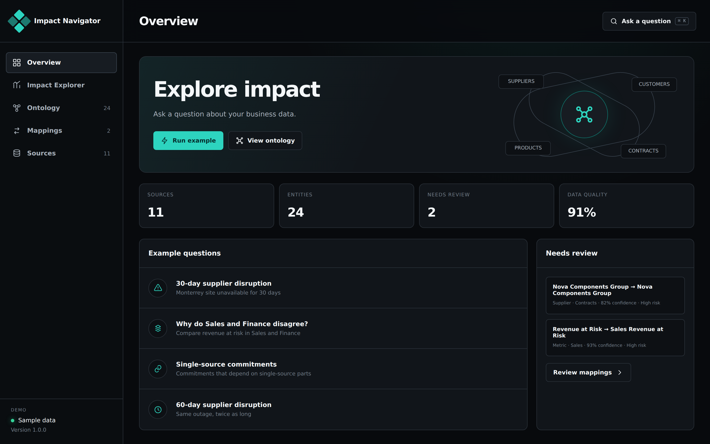
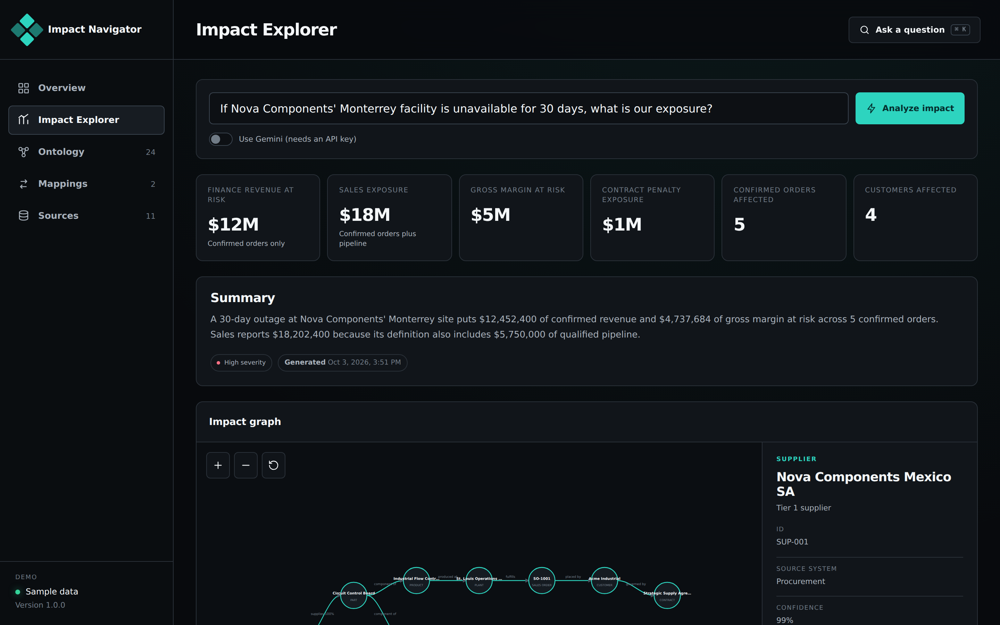
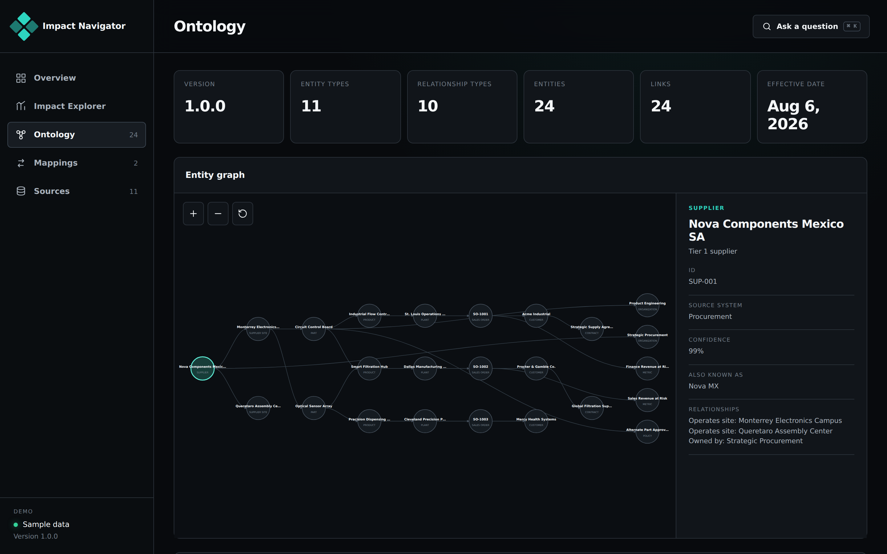
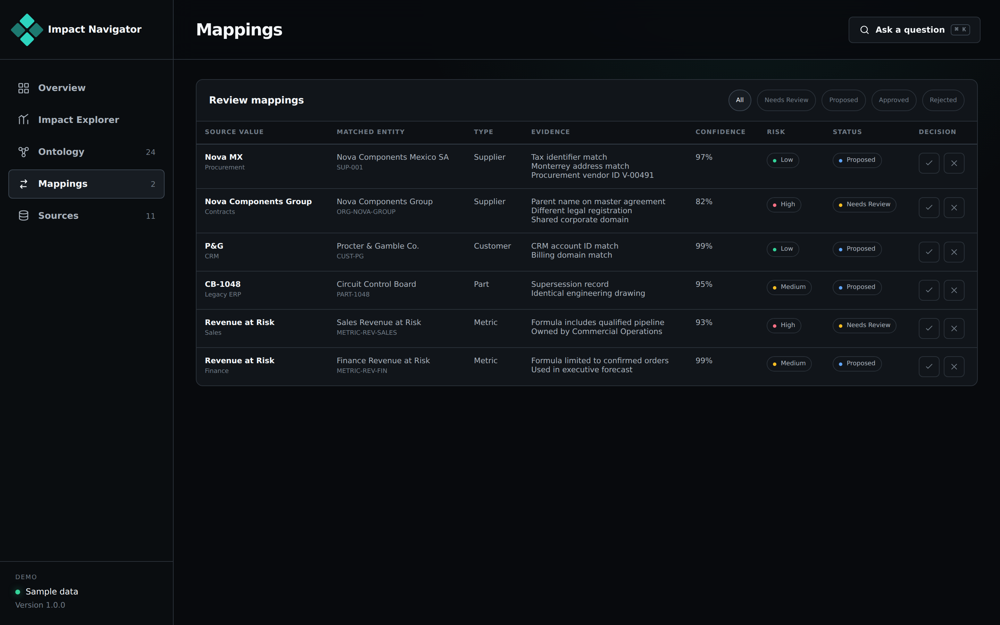

# Enterprise Impact Navigator

Enterprise Impact Navigator is a full-stack enterprise ontology demonstration designed for Google AI Studio Build mode and Gemini Managed Agents. It turns disconnected ERP, procurement, CRM, finance, contract, inventory, and organization data into evidence-backed impact analysis.

The primary demonstration question is:

> If Nova Components' Monterrey facility is unavailable for 30 days, which products, plants, customer commitments, contracts, revenue, and owners are affected, and what should we do next?

## Screenshots

### Overview

Source, entity, and review counts, with example questions to start from.



### Impact Explorer

The 30-day supplier disruption: exposure numbers, summary, and impact graph.



### Ontology

Entities and relationships, with details for the selected entity.



### Mappings

Source values matched to entities, with evidence, confidence, and risk for each match.



## Included

- Dependency-free Node.js server and browser application
- Synthetic enterprise data package with deliberate cross-system inconsistencies
- Deterministic ontology and impact engine for reliable demonstrations
- Optional Gemini Managed Agent execution path
- Ontology graph exploration and evidence tracing
- Metric-definition conflict analysis
- Entity-resolution governance workbench
- Source catalog and lineage metadata
- Google Docs and Google Sheets export adapters
- Automated data-integrity and scenario tests
- Cloud Run compatible Dockerfile

## Run locally

```bash
cp .env.example .env.local
npm start
```

Open `http://localhost:3000`.

No npm install is required. The app uses Node.js built-in modules and browser-native APIs.

## Validate

```bash
npm run validate
```

## Import into Google AI Studio

1. Open Google AI Studio Build mode.
2. Choose **Import from GitHub**.
3. Select this repository.
4. Add `GEMINI_API_KEY` in the app Secrets panel.
5. Run the application.

The deterministic engine works without secrets. When `GEMINI_API_KEY` is configured, the Managed Agent toggle becomes available and the server invokes the Gemini Interactions API with `agent/` and `demo-data/` mounted into the remote environment.

## Managed agent structure

```text
agent/
├── AGENTS.md
├── agent.yaml
├── requirements.txt
└── skills/
    ├── source-profiler/
    ├── ontology-compiler/
    ├── impact-analyzer/
    ├── evidence-tracer/
    ├── governance-review/
    └── decision-brief/
```

The app invokes `antigravity-preview-05-2026` by default with inline mounted sources. Set `MANAGED_AGENT_ID` to invoke a separately registered managed agent.

## Demo flow

1. Open **Overview** and explain the fragmented sources.
2. Run the **30-day supplier disruption**.
3. Select an evidence path and inspect the graph.
4. Open **Mappings** and resolve ambiguous identities.
5. Run **Why do Sales and Finance disagree?**
6. Export the decision brief and mitigation tracker.

See `docs/DEMO-SCRIPT.md`.

## Configuration

| Variable | Purpose |
| --- | --- |
| `PORT` | HTTP port. Defaults to 3000. |
| `GEMINI_API_KEY` | Enables Gemini Managed Agent execution. |
| `MANAGED_AGENT_ID` | Optional registered managed-agent ID. |
| `GOOGLE_ACCESS_TOKEN` | Enables Google Docs and Sheets creation. |
| `GOOGLE_MAPS_API_KEY` | Reserved for an optional Maps implementation. |

## Documentation

- `docs/ARCHITECTURE.md`
- `docs/DEMO-SCRIPT.md`
- `docs/DATA-DICTIONARY.md`
- `docs/AI-STUDIO-SETUP.md`
- `DESIGN.md` (UI copy rules)
